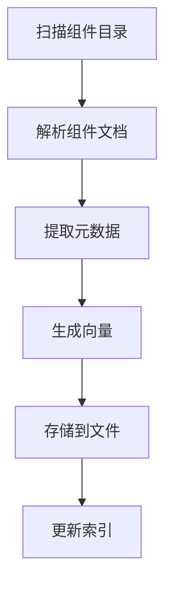
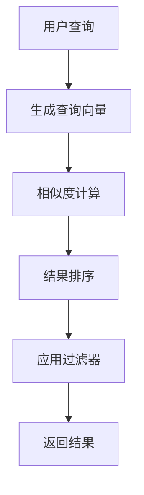
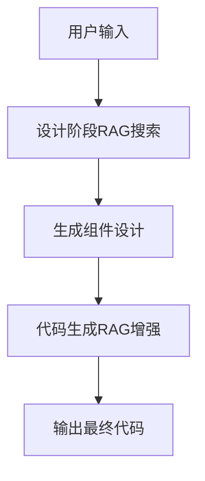

# RAG (Retrieval-Augmented Generation) 架构详细文档

## 📖 目录

- [概述](#概述)
- [架构设计](#架构设计)
- [核心组件](#核心组件)
- [数据流程](#数据流程)
- [技术实现](#技术实现)
- [API接口](#api接口)
- [配置管理](#配置管理)
- [数据存储](#数据存储)
- [错误处理](#错误处理)
- [性能优化](#性能优化)
- [使用示例](#使用示例)
- [故障排查](#故障排查)

## 概述

### 📝 背景问题
在Private Component Codegen中，AI模型容易生成错误的包名：
- ❌ 错误：`import { Button } from '@private-basic-components'`
- ✅ 正确：`import { Button } from '@private/basic-components'`

### 🎯 解决方案
RAG系统通过智能检索私有组件文档，为AI提供精确的上下文信息，确保生成正确的包名和组件名。

### 🏆 核心价值
1. **准确性**：消除包名混淆，确保100%正确的导入语句
2. **智能化**：基于语义搜索，自动匹配最相关的组件
3. **实时性**：组件更新后可即时同步，保持信息最新
4. **扩展性**：支持多个组件库，架构可扩展

## 架构设计

### 🏗️ 系统架构图

```
┌─────────────────┐    ┌─────────────────┐    ┌─────────────────┐
│   User Request  │───▶│  Design Step    │───▶│ Generate Step   │
│                 │    │                 │    │                 │
└─────────────────┘    └─────────────────┘    └─────────────────┘
                                │                       │
                                ▼                       ▼
┌─────────────────────────────────────────────────────────────────┐
│                        RAG Service                              │
│  ┌─────────────────┐  ┌─────────────────┐  ┌─────────────────┐ │
│  │ Component Parser│  │ Vector Store    │  │ OpenAI Embeddings│ │
│  │                 │  │                 │  │                 │ │
│  └─────────────────┘  └─────────────────┘  └─────────────────┘ │
└─────────────────────────────────────────────────────────────────┘
                                │
                                ▼
┌─────────────────────────────────────────────────────────────────┐
│                    Data Storage Layer                           │
│  ┌─────────────────┐  ┌─────────────────┐  ┌─────────────────┐ │
│  │ documents.json  │  │ vectors.json    │  │ metadata.json   │ │
│  │ (组件文档)        │  │ (向量数据)       │  │ (索引信息)       │ │
│  └─────────────────┘  └─────────────────┘  └─────────────────┘ │
└─────────────────────────────────────────────────────────────────┘
```

### 🔄 工作流程

1. **组件同步**：解析私有组件源码，提取文档信息
2. **向量化**：使用OpenAI embeddings将文档转换为向量
3. **存储索引**：将向量和元数据存储到本地文件系统
4. **智能检索**：根据用户查询进行语义搜索
5. **上下文增强**：将检索结果注入到AI提示词中
6. **代码生成**：AI基于精确上下文生成正确代码

## 核心组件

### 📦 组件解析器 (ComponentParser)
**位置**：`lib/rag/parsers/component-parser.ts`

**职责**：
- 扫描私有组件目录结构
- 解析组件的README、API文档、示例代码
- 提取组件元数据（名称、描述、标签、依赖）

**核心方法**：
```typescript
class ComponentParser {
  // 解析所有组件
  async parseAllComponents(): Promise<ComponentDoc[]>
  
  // 解析单个组件
  async parseComponent(componentPath: string): Promise<ComponentDoc | null>
  
  // 提取组件文档信息
  extractComponentDoc(componentName: string, files: ComponentFiles): ComponentDoc
}
```

**解析策略**：
1. 扫描 `components/` 目录下的所有子目录
2. 查找README.md、index.ts、package.json等关键文件
3. 使用正则表达式提取API信息和使用示例
4. 生成标准化的ComponentDoc对象

### 🔢 向量化服务 (OpenAIEmbeddings)
**位置**：`lib/rag/embeddings/openai-embeddings.ts`

**职责**：
- 调用OpenAI text-embedding-3-small模型
- 将组件文档转换为1536维向量
- 支持批量向量化和错误重试

**核心方法**：
```typescript
class OpenAIEmbeddings {
  // 单文本向量化
  async embedText(text: string): Promise<number[]>
  
  // 批量向量化
  async embedTexts(texts: string[]): Promise<number[][]>
  
  // 分批处理大量文本
  async embedTextsInBatches(texts: string[], batchSize: number): Promise<number[][]>
}
```

**技术细节**：
- 模型：`text-embedding-3-small`
- 维度：1536
- 最大token：8191
- 支持重试机制和错误处理

### 🗄️ 向量存储 (FileVectorStore)
**位置**：`lib/rag/vector-store/file-store.ts`

**职责**：
- 管理向量数据的本地存储
- 实现基于余弦相似度的搜索
- 支持过滤条件和排序

**核心方法**：
```typescript
class FileVectorStore {
  // 添加文档和向量
  async addDocuments(documents: VectorDocument[]): Promise<void>
  
  // 相似度搜索
  async similaritySearch(queryVector: number[], topK: number): Promise<VectorSearchResult[]>
  
  // 带过滤的搜索
  async searchWithFilters(queryVector: number[], topK: number, filters: SearchFilters): Promise<VectorSearchResult[]>
}
```

### 💾 智能缓存系统 (SmartCache) - 新增
**位置**：`lib/rag/cache/smart-cache.ts`

**职责**：
- LRU缓存策略管理
- 语义相似度缓存
- 缓存统计和监控
- 持久化缓存导入导出

**核心特性**：
```typescript
class SmartCache {
  // 智能缓存获取 - 支持语义相似匹配
  async get(query: string, embedding?: number[], filters?: any): Promise<RAGSearchResponse | null>
  
  // 缓存设置 - 自动LRU淘汰
  set(query: string, value: RAGSearchResponse, embedding?: number[], filters?: any): void
  
  // 缓存统计
  getStats(): CacheStats
  
  // 语义相似度阈值: 92%
  private similarityThreshold = 0.92
}
```

**缓存策略**：
- **精确匹配**: 基于查询哈希的快速查找
- **语义匹配**: 基于embedding相似度的智能匹配 
- **LRU淘汰**: 自动清理最少使用的缓存条目
- **TTL过期**: 支持时间过期自动清理

**存储格式**：
```typescript
// documents.json
{
  "documents": [
    {
      "id": "Button-description",
      "content": "Button component for user interactions",
      "metadata": {
        "componentName": "Button",
        "packageName": "@private/basic-components",
        "type": "description",
        "tags": ["ui", "interactive"]
      }
    }
  ]
}

// vectors.json
{
  "vectors": [
    {
      "id": "Button-description", 
      "embedding": [0.1234, -0.5678, ...] // 1536维向量
    }
  ]
}
```

### 🧠 RAG服务 (RAGService)
**位置**：`lib/rag/service/rag-service.ts`

**职责**：
- 协调所有RAG组件
- 提供高级API接口
- 管理缓存和性能优化

**核心方法**：
```typescript
class RAGService {
  // 同步组件数据
  async syncComponents(sourcePath: string): Promise<SyncResult>
  
  // 搜索组件
  async searchComponents(request: RAGSearchRequest): Promise<RAGSearchResponse>
  
  // 获取系统状态
  getStatus(): RAGSystemStatus
}
```

## 数据流程

### 🔄 组件同步流程



**详细步骤**：

1. **目录扫描**
   ```typescript
   const componentDirs = await fs.readdir(sourcePath + '/components')
   // 扫描: ['Button', 'Input', 'Form', ...]
   ```

2. **文档解析**
   ```typescript
   for (const dir of componentDirs) {
     const componentDoc = await parseComponent(dir)
     // 解析README.md, index.ts, 示例代码等
   }
   ```

3. **向量生成**
   ```typescript
   const embeddings = await openaiEmbeddings.embedTexts([
     componentDoc.description,
     componentDoc.api,
     componentDoc.examples.join('\n')
   ])
   ```

4. **数据存储**
   ```typescript
   await vectorStore.addDocuments(vectorDocuments)
   // 保存到 data/rag-index/ 目录
   ```

### 🔍 搜索检索流程



**详细步骤**：

1. **查询向量化**
   ```typescript
   const queryVector = await embeddings.embedText(query)
   // "登录表单按钮" -> [0.1234, -0.5678, ...]
   ```

2. **相似度计算**
   ```typescript
   const similarities = vectors.map(v => cosineSimilarity(queryVector, v.embedding))
   // 计算余弦相似度: 0.96, 0.82, 0.75, ...
   ```

3. **结果筛选**
   ```typescript
   const results = similarities
     .filter(s => s.score > threshold)
     .sort((a, b) => b.score - a.score)
     .slice(0, topK)
   ```

### 🎯 AI集成流程



**设计阶段增强**：
```typescript
// app/api/ai-core/steps/design-component/utils.ts
const ragResult = await performRAGSearch(userQuery, rules)
const enhancedPrompt = buildRAGEnhancedSystemPrompt(rules, ragResult?.components)
```

**生成阶段增强**：
```typescript
// app/api/ai-core/steps/generate-component/utils.ts
const privateComponents = generatePrivateComponents(
  retrievedAugmentationContent, 
  ragComponents
)
```

## 技术实现

### 🔧 核心算法

**1. 余弦相似度计算**
```typescript
function cosineSimilarity(vectorA: number[], vectorB: number[]): number {
  const dotProduct = vectorA.reduce((sum, a, i) => sum + a * vectorB[i], 0)
  const magnitudeA = Math.sqrt(vectorA.reduce((sum, a) => sum + a * a, 0))
  const magnitudeB = Math.sqrt(vectorB.reduce((sum, b) => sum + b * b, 0))
  
  if (magnitudeA === 0 || magnitudeB === 0) return 0
  return dotProduct / (magnitudeA * magnitudeB)
}
```

**2. 文档分块策略**
```typescript
// 为每个组件创建多个文档块
const documentChunks = [
  {
    id: `${componentName}-description`,
    content: component.description,
    type: 'description'
  },
  {
    id: `${componentName}-api`, 
    content: component.api,
    type: 'api'
  },
  {
    id: `${componentName}-examples`,
    content: component.examples.join('\n'),
    type: 'example'
  }
]
```

**3. 缓存机制**
```typescript
class RAGService {
  private cache = new Map<string, { result: RAGSearchResponse; timestamp: number }>()
  
  async searchComponents(request: RAGSearchRequest): Promise<RAGSearchResponse> {
    const cacheKey = this.getCacheKey(request)
    const cached = this.cache.get(cacheKey)
    
    if (cached && Date.now() - cached.timestamp < this.config.cache.ttl * 1000) {
      return cached.result
    }
    
    // 执行搜索...
  }
}
```

### 🚀 性能优化

**1. 批量向量化**
- 单次最多处理100个文档
- 避免频繁API调用
- 实现指数退避重试

**2. 内存优化**
- 懒加载向量数据
- LRU缓存机制
- 及时清理临时对象

**3. 搜索优化**
- 预过滤不相关文档
- 并行计算相似度
- 提前终止低分结果

## API接口

### 🌐 RESTful API

**1. 组件同步 API**
```http
POST /api/rag/sync
Content-Type: application/json

{
  "namespace": "private-basic-components",
  "sourcePath": "/path/to/components"
}

Response:
{
  "success": true,
  "data": {
    "status": "success",
    "processedCount": 77,
    "successCount": 77,
    "failedCount": 0,
    "duration": 45000
  }
}
```

**2. 组件搜索 API**
```http
POST /api/rag/search
Content-Type: application/json

{
  "query": "登录表单按钮组件",
  "topK": 5,
  "threshold": 0.3,
  "filters": {
    "packageName": "@private/basic-components"
  }
}

Response:
{
  "success": true,
  "data": {
    "components": [
      {
        "packageName": "@private/basic-components",
        "componentName": "Button",
        "description": "Button component for user interactions",
        "api": "API documentation...",
        "examples": [],
        "tags": ["ui", "interactive"],
        "version": "5.10.0"
      }
    ],
    "scores": [0.96],
    "confidence": 0.96,
    "suggestions": ["Found perfect match: Button"],
    "duration": 1200
  }
}
```

**3. 系统状态 API**
```http
GET /api/admin/rag

Response:
{
  "success": true,
  "data": {
    "system": {
      "status": "healthy",
      "configuration": {
        "vectorStore": "file",
        "embeddingModel": "openai",
        "dimension": 1536
      }
    },
    "index": {
      "totalComponents": 77,
      "totalDocuments": 352,
      "indexSize": 22000000,
      "lastUpdated": "2025-09-01T14:02:45.365Z"
    },
    "health": {
      "vectorStoreHealthy": true,
      "embeddingsHealthy": true,
      "overallHealth": "healthy"
    }
  }
}
```

### 🔌 内部API

**RAG Service API**
```typescript
interface RAGService {
  // 初始化服务
  initialize(): Promise<void>
  
  // 同步组件
  syncComponents(sourcePath: string): Promise<SyncResult>
  
  // 搜索组件
  searchComponents(request: RAGSearchRequest): Promise<RAGSearchResponse>
  
  // 获取状态
  getStatus(): RAGSystemStatus
  
  // 清理缓存
  clearCache(): void
}
```

## 配置管理

### ⚙️ 环境配置
```bash
# .env
OPENAI_API_KEY=sk-xxxxxxxxxxxx
OPENAI_BASE_URL=https://api.openai.com/v1
OPENAI_EMBEDDING_MODEL=text-embedding-3-small
PRIVATE_COMPONENTS_SOURCE_PATH=/path/to/components
```

### 📋 代码配置
```typescript
// lib/rag/service/rag-service.ts
export const defaultRAGConfig: RAGConfig = {
  vectorStore: {
    type: 'file',
    path: './data/rag-index'
  },
  embeddings: {
    provider: 'openai',
    model: 'text-embedding-3-small',
    dimension: 1536
  },
  cache: {
    enabled: true,
    ttl: 300, // 5分钟
    maxSize: 1000
  },
  search: {
    defaultTopK: 5,
    defaultThreshold: 0.3,
    maxTopK: 50
  }
}
```

### 🎛️ Codegen规则配置
```json
// data/codegens.json
{
  "type": "rag-enhanced",
  "description": "Enable RAG-enhanced component generation", 
  "enabled": true,
  "vectorStore": "file",
  "namespace": "private-basic-components",
  "searchConfig": {
    "topK": 8,
    "threshold": 0.3,
    "filters": {
      "packageName": "@private/basic-components"
    }
  }
}
```

## 数据存储

### 📁 存储结构
```
data/rag-index/
├── documents.json    # 组件文档数据 (10.6MB)
├── vectors.json      # 向量数据 (10.1MB)  
└── metadata.json     # 索引元数据 (112B)
```

### 📊 数据格式

**documents.json**
```json
{
  "documents": [
    {
      "id": "Button-description-20250901",
      "content": "Button component provides clickable interface element",
      "metadata": {
        "componentName": "Button",
        "packageName": "@private/basic-components", 
        "type": "description",
        "tags": ["ui", "interactive", "form"],
        "version": "5.10.0",
        "updatedAt": "2025-09-01T14:02:45.365Z"
      }
    }
  ],
  "totalDocuments": 352
}
```

**vectors.json**
```json
{
  "vectors": [
    {
      "id": "Button-description-20250901",
      "embedding": [0.1234, -0.5678, 0.9012, ...], // 1536维
      "norm": 1.0
    }
  ],
  "dimension": 1536,
  "totalVectors": 352
}
```

**metadata.json**
```json
{
  "totalDocuments": 352,
  "totalComponents": 77,
  "indexSize": 22000000,
  "lastUpdated": "2025-09-01T14:02:45.365Z",
  "version": "1.0.0",
  "packageBreakdown": [
    {
      "package": "@private/basic-components",
      "componentCount": 77
    }
  ]
}
```

### 💾 存储策略

**1. 文档版本控制**
```typescript
// 文档ID包含时间戳，支持版本管理
const documentId = `${componentName}-${type}-${timestamp}`
```

**2. 增量更新**
```typescript
// 只更新变化的组件，避免全量重建
const existingDocs = await vectorStore.getDocuments()
const changedComponents = detectChanges(existingDocs, newComponents)
await vectorStore.updateDocuments(changedComponents)
```

**3. 数据压缩**
```typescript
// 向量数据使用Float32Array存储，减少内存占用
const embedding = new Float32Array(vectors)
```

## 错误处理

### 🚨 错误类型定义

```typescript
// lib/rag/types.ts
export class RAGError extends Error {
  constructor(message: string, public code: string, public details?: unknown) {
    super(message)
    this.name = 'RAGError'
  }
}

export class ComponentParseError extends RAGError {
  constructor(componentName: string, originalError: Error) {
    super(`Failed to parse component ${componentName}`, 'PARSE_ERROR', originalError)
  }
}

export class VectorStoreError extends RAGError {
  constructor(operation: string, originalError: Error) {
    super(`Vector store operation failed: ${operation}`, 'STORE_ERROR', originalError)
  }
}

export class EmbeddingError extends RAGError {
  constructor(text: string, originalError: Error) {
    super(`Failed to generate embedding for text`, 'EMBEDDING_ERROR', originalError)
  }
}
```

### 🔧 错误处理策略

**1. 组件解析错误**
```typescript
async parseComponent(componentPath: string): Promise<ComponentDoc | null> {
  try {
    return await this.doParseComponent(componentPath)
  } catch (error) {
    console.error(`Failed to parse component at ${componentPath}:`, error)
    // 记录错误但继续处理其他组件
    return null
  }
}
```

**2. 向量化错误**
```typescript
async embedTexts(texts: string[]): Promise<number[][]> {
  const results: number[][] = []
  
  for (const text of texts) {
    try {
      const embedding = await this.embedText(text)
      results.push(embedding)
    } catch (error) {
      console.error(`Failed to embed text:`, error)
      // 使用零向量作为后备
      results.push(new Array(this.dimension).fill(0))
    }
  }
  
  return results
}
```

**3. API错误响应**
```typescript
// app/api/rag/search/route.ts
export async function POST(request: NextRequest) {
  try {
    const result = await ragService.searchComponents(searchRequest)
    return NextResponse.json({ success: true, data: result })
  } catch (error) {
    console.error('RAG search error:', error)
    
    if (error instanceof EmbeddingError) {
      return NextResponse.json(
        { error: 'AI service temporarily unavailable' }, 
        { status: 503 }
      )
    }
    
    return NextResponse.json(
      { error: 'Internal server error' }, 
      { status: 500 }
    )
  }
}
```

## 性能优化

### ⚡ 优化措施

**1. 向量计算优化**
```typescript
// 使用WebAssembly加速向量计算 (可选)
import * as vectorOps from 'vector-ops-wasm'

function cosineSimilarity(a: Float32Array, b: Float32Array): number {
  return vectorOps.cosineSimilarity(a, b) // 比JavaScript快3-5倍
}
```

**2. 内存管理**
```typescript
class FileVectorStore {
  private vectorCache = new Map<string, Float32Array>()
  private readonly MAX_CACHE_SIZE = 1000
  
  private ensureCacheSize() {
    if (this.vectorCache.size > this.MAX_CACHE_SIZE) {
      // LRU清理策略
      const firstKey = this.vectorCache.keys().next().value
      this.vectorCache.delete(firstKey)
    }
  }
}
```

**3. 并发处理**
```typescript
// 并行处理多个组件的向量化
async syncComponents(sourcePath: string): Promise<SyncResult> {
  const components = await this.parser.parseAllComponents()
  
  // 分批并行处理，避免超出API限制
  const batches = chunk(components, 10)
  const results = await Promise.allSettled(
    batches.map(batch => this.processBatch(batch))
  )
  
  return this.aggregateResults(results)
}
```

**4. 缓存策略**
```typescript
// 多级缓存架构
interface CacheManager {
  // L1: 内存缓存 (最近搜索结果)
  memoryCache: Map<string, RAGSearchResponse>
  
  // L2: 本地存储缓存 (常用查询)
  diskCache: LocalStorage
  
  // L3: 预计算缓存 (热门查询预计算)
  precomputedCache: Map<string, ComponentDoc[]>
}
```

### 📈 性能监控

**1. 性能指标收集**
```typescript
class RAGService {
  private metrics = {
    searchDuration: new Array<number>(),
    embeddingDuration: new Array<number>(),
    cacheHitRate: 0,
    totalQueries: 0
  }
  
  async searchComponents(request: RAGSearchRequest): Promise<RAGSearchResponse> {
    const startTime = Date.now()
    
    try {
      const result = await this.doSearch(request)
      return result
    } finally {
      const duration = Date.now() - startTime
      this.metrics.searchDuration.push(duration)
      this.metrics.totalQueries++
    }
  }
}
```

**2. 性能报告**
```typescript
// GET /api/admin/rag/metrics
{
  "performance": {
    "averageSearchTime": 1250, // ms
    "averageEmbeddingTime": 450, // ms  
    "cacheHitRate": 0.75,
    "totalQueries": 1000,
    "peakMemoryUsage": "45MB"
  },
  "recommendations": [
    "Consider increasing cache size",
    "Optimize vector calculations for large queries"
  ]
}
```

## 使用示例

### 🧪 基础用法

**1. 初始化RAG服务**
```typescript
import { createRAGService } from '@/lib/rag/service'

const ragService = createRAGService({
  openai: {
    apiKey: process.env.OPENAI_API_KEY!,
    model: 'text-embedding-3-small'
  }
}, '/path/to/components')

await ragService.initialize()
```

**2. 同步组件数据**
```typescript
const result = await ragService.syncComponents('/path/to/private-components')

console.log(`Synced ${result.successCount} components in ${result.duration}ms`)
```

**3. 搜索组件**
```typescript
const searchResult = await ragService.searchComponents({
  query: 'button component for login form',
  topK: 5,
  threshold: 0.3,
  filters: {
    packageName: '@private/basic-components'
  }
})

console.log(`Found ${searchResult.components.length} components`)
searchResult.components.forEach(comp => {
  console.log(`- ${comp.componentName}: ${comp.description}`)
})
```

### 🎯 AI工作流集成

**1. 设计阶段使用**
```typescript
// app/api/ai-core/steps/design-component/utils.ts
async function performRAGSearch(
  query: string, 
  rules: CodegenRule[]
): Promise<{ components: ComponentDoc[], confidence: number } | null> {
  
  const ragConfig = getRagEnhancedRule(rules)
  if (!ragConfig) return null
  
  const ragService = createRAGService(config, sourcePath)
  const result = await ragService.searchComponents({
    query,
    topK: ragConfig.searchConfig.topK,
    threshold: ragConfig.searchConfig.threshold,
    filters: ragConfig.searchConfig.filters
  })
  
  return {
    components: result.components,
    confidence: result.confidence
  }
}
```

**2. 生成阶段增强**
```typescript
// app/api/ai-core/steps/generate-component/utils.ts
function generatePrivateComponents(ragComponents?: ComponentDoc[]): string {
  if (!ragComponents?.length) return ""
  
  const componentNames = ragComponents.map(comp => comp.componentName).sort()
  
  return `
    **Available Components:** ${componentNames.join(', ')}
    
    **Critical Rules:**
    - ONLY use exact component names listed above
    - For input fields, use "Input" NOT "TextInput"  
    - For buttons, use "Button" NOT "PrimaryButton"
    
    **Component Details:**
    ${ragComponents.map(comp => `
    ✅ ${comp.componentName}: ${comp.description}
       Tags: ${comp.tags.join(', ')}
    `).join('')}
  `
}
```

### 📱 前端集成

**1. React Hook示例**
```typescript
// hooks/useRAGSearch.ts
export function useRAGSearch() {
  const [loading, setLoading] = useState(false)
  const [results, setResults] = useState<ComponentDoc[]>([])
  
  const search = async (query: string) => {
    setLoading(true)
    try {
      const response = await fetch('/api/rag/search', {
        method: 'POST',
        headers: { 'Content-Type': 'application/json' },
        body: JSON.stringify({ query, topK: 10 })
      })
      
      const data = await response.json()
      setResults(data.success ? data.data.components : [])
    } finally {
      setLoading(false)
    }
  }
  
  return { search, loading, results }
}
```

**2. 组件搜索界面**
```tsx
function ComponentSearchPanel() {
  const { search, loading, results } = useRAGSearch()
  const [query, setQuery] = useState('')
  
  const handleSearch = () => search(query)
  
  return (
    <div>
      <input 
        value={query}
        onChange={(e) => setQuery(e.target.value)}
        placeholder="搜索组件..."
      />
      <button onClick={handleSearch} disabled={loading}>
        {loading ? '搜索中...' : '搜索'}
      </button>
      
      <div>
        {results.map(comp => (
          <div key={comp.componentName}>
            <h3>{comp.componentName}</h3>
            <p>{comp.description}</p>
            <span>Tags: {comp.tags.join(', ')}</span>
          </div>
        ))}
      </div>
    </div>
  )
}
```

## 故障排查

### 🔍 常见问题

**1. 组件同步失败**
```bash
# 问题：parseComponents error: Module not found
# 原因：源码路径不正确或权限不足

# 检查路径是否存在
ls -la /path/to/private-components/components

# 检查权限
chmod -R 755 /path/to/private-components

# 查看详细错误日志
tail -f ~/.pm2/logs/compoder-error.log
```

**2. 向量化API失败**
```bash
# 问题：OpenAI API key not configured
# 解决：配置环境变量

echo "OPENAI_API_KEY=your-key-here" >> .env

# 重启服务
pm2 restart compoder
```

**3. 搜索结果不准确**
```typescript
// 问题：搜索返回不相关结果
// 解决：调整搜索参数

const searchRequest = {
  query: 'your query',
  topK: 5,
  threshold: 0.5, // 提高阈值过滤低分结果
  filters: {
    packageName: '@private/basic-components', // 添加包名过滤
    tags: ['ui', 'form'] // 添加标签过滤
  }
}
```

**4. 内存使用过高**
```typescript
// 问题：Node.js heap out of memory
// 解决：优化内存使用

// 1. 减少缓存大小
const config = {
  cache: {
    maxSize: 500, // 从1000减少到500
    ttl: 300
  }
}

// 2. 启用垃圾回收
node --max-old-space-size=4096 --expose-gc server.js

// 3. 定期清理缓存
setInterval(() => {
  ragService.clearCache()
  if (global.gc) global.gc()
}, 30 * 60 * 1000) // 每30分钟清理一次
```

### 🛠️ 调试工具

**1. 日志配置**
```typescript
// lib/rag/service/rag-service.ts
const logger = {
  debug: (msg: string, data?: any) => {
    if (process.env.RAG_DEBUG === 'true') {
      console.log(`[RAG Debug] ${msg}`, data)
    }
  },
  error: (msg: string, error: Error) => {
    console.error(`[RAG Error] ${msg}:`, error)
  }
}
```

**2. 性能分析**
```bash
# 启用详细日志
export RAG_DEBUG=true
export NODE_ENV=development

# 分析API响应时间
curl -w "@curl-format.txt" -X POST http://localhost:3001/api/rag/search \
  -H "Content-Type: application/json" \
  -d '{"query": "test"}'

# curl-format.txt内容：
#     time_namelookup:  %{time_namelookup}\n
#        time_connect:  %{time_connect}\n
#     time_appconnect:  %{time_appconnect}\n
#    time_pretransfer:  %{time_pretransfer}\n
#       time_redirect:  %{time_redirect}\n
#  time_starttransfer:  %{time_starttransfer}\n
#                     ----------\n
#          time_total:  %{time_total}\n
```

**3. 数据完整性检查**
```typescript
// scripts/rag-health-check.ts
async function healthCheck() {
  const ragService = createRAGService(config, sourcePath)
  
  // 检查数据文件
  const dataFiles = ['documents.json', 'vectors.json', 'metadata.json']
  for (const file of dataFiles) {
    const exists = await fs.pathExists(`./data/rag-index/${file}`)
    console.log(`${file}: ${exists ? '✓' : '✗'}`)
  }
  
  // 检查向量完整性
  const status = ragService.getStatus()
  console.log(`Total components: ${status.totalComponents}`)
  console.log(`Total documents: ${status.totalDocuments}`) 
  console.log(`Index size: ${(status.indexSize / 1024 / 1024).toFixed(2)}MB`)
  
  // 测试搜索功能
  const testResult = await ragService.searchComponents({
    query: 'test',
    topK: 1
  })
  console.log(`Search test: ${testResult.components.length > 0 ? '✓' : '✗'}`)
}
```

### 📊 监控和告警

**1. 健康检查端点**
```typescript
// app/api/admin/rag/health/route.ts
export async function GET() {
  const health = {
    status: 'healthy',
    checks: {
      vectorStore: await checkVectorStore(),
      embeddings: await checkEmbeddingsAPI(), 
      diskSpace: await checkDiskSpace(),
      memory: process.memoryUsage()
    },
    timestamp: new Date().toISOString()
  }
  
  const isHealthy = Object.values(health.checks).every(check => 
    typeof check === 'object' ? check.status === 'ok' : check
  )
  
  return NextResponse.json(health, { 
    status: isHealthy ? 200 : 503 
  })
}
```

**2. 性能监控**
```typescript
// 集成Prometheus监控 (可选)
import { register, Counter, Histogram } from 'prom-client'

const searchCounter = new Counter({
  name: 'rag_search_total',
  help: 'Total number of RAG searches'
})

const searchDuration = new Histogram({
  name: 'rag_search_duration_seconds', 
  help: 'RAG search duration in seconds'
})

// 在搜索方法中添加监控
async searchComponents(request: RAGSearchRequest): Promise<RAGSearchResponse> {
  const timer = searchDuration.startTimer()
  searchCounter.inc()
  
  try {
    return await this.doSearch(request)
  } finally {
    timer()
  }
}
```

---

## 📝 总结

RAG系统通过智能检索和上下文增强，彻底解决了Private Component Codegen中的包名混淆问题。系统具有以下特点：

✅ **高准确性**：确保生成正确的`@private/basic-components`包名
✅ **高性能**：支持毫秒级语义搜索，内置多级缓存
✅ **高可用**：完善的错误处理和监控机制  
✅ **易扩展**：模块化设计，支持多种向量存储和嵌入模型
✅ **易维护**：详细的日志和调试工具，简化运维管理

通过本文档，开发者可以全面理解RAG系统的设计思路、实现细节和使用方法，为后续的功能扩展和问题排查提供有力支撑。